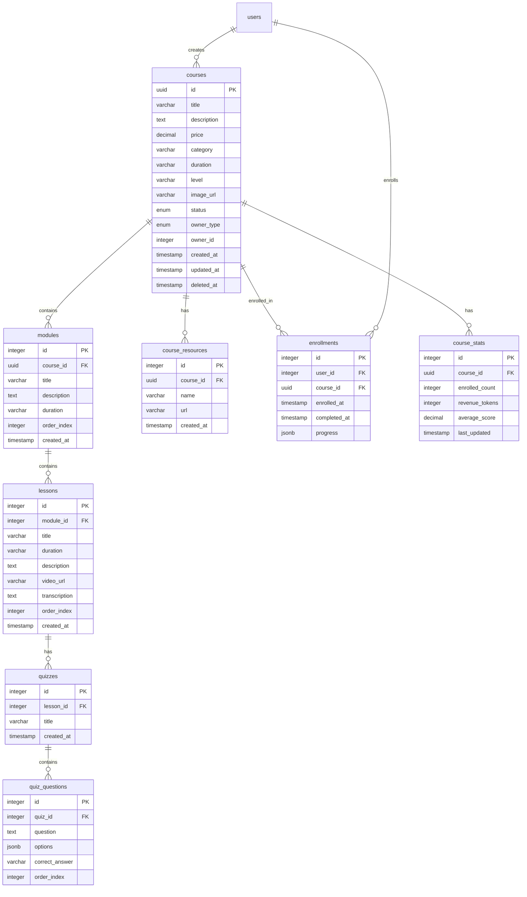

# 📚 Spécification API - Gestion Complète des Cours

## Table des matières

1. [Introduction](#introduction)
2. [Architecture de la base de données](#architecture-de-la-base-de-données)
3. [Modèles Pydantic](#modèles-pydantic)
4. [Endpoints API](#endpoints-api)
5. [Système de permissions](#système-de-permissions)
6. [Logique métier](#logique-métier)
7. [Gestion des catalogues](#gestion-des-catalogues)
8. [Upload de fichiers](#upload-de-fichiers)
9. [Validations et contraintes](#validations-et-contraintes)
10. [Sécurité](#sécurité)
11. [Structure backend recommandée](#structure-backend-recommandée)
12. [Exemples de code](#exemples-de-code)
13. [Tests à implémenter](#tests-à-implémenter)
14. [Optimisations](#optimisations)

---

## Introduction

### Objectif
Créer une API complète pour la gestion des cours dans la plateforme LearnEezy, permettant :
- La création et gestion de cours par différents types d'utilisateurs (formateurs, organismes, administrateurs)
- L'inscription des étudiants aux cours
- Le suivi de progression
- La gestion des modules, leçons et quizzes
- L'upload de médias (images, vidéos)
- Les statistiques et analytics

### Contexte
- **Backend** : FastAPI avec PostgreSQL
- **Authentification** : JWT tokens
- **Rôles** : superadmin, of_admin, formateur_interne, createur_contenu, independent_trainer, student/apprenant

### Principes clés
- **Multi-tenant** : Cours appartenant soit à LearnEezy (plateforme) soit à des organismes de formation (OF)
- **Contrôle d'accès** : Via catalogues et rôles utilisateurs
- **Progression** : Tracking détaillé par module
- **Soft delete** : Pas de suppression définitive des cours

---

## Architecture de la base de données

### Schéma relationnel



### Schéma SQL complet

```sql
-- Table des cours
CREATE TABLE courses (
    id UUID PRIMARY KEY DEFAULT gen_random_uuid(),
    title VARCHAR(200) NOT NULL,
    description TEXT NOT NULL,
    price DECIMAL(10,2) DEFAULT 0,
    category VARCHAR(100),
    duration VARCHAR(50),
    level VARCHAR(50) NOT NULL,
    image_url VARCHAR(500),
    status VARCHAR(20) DEFAULT 'draft' CHECK (status IN ('draft', 'published')),
    owner_type VARCHAR(20) NOT NULL CHECK (owner_type IN ('learneezy', 'of')),
    owner_id INTEGER NOT NULL,
    created_at TIMESTAMP DEFAULT CURRENT_TIMESTAMP,
    updated_at TIMESTAMP DEFAULT CURRENT_TIMESTAMP,
    deleted_at TIMESTAMP NULL,
    
    INDEX idx_courses_status (status),
    INDEX idx_courses_owner (owner_type, owner_id),
    INDEX idx_courses_deleted (deleted_at)
);

-- Table des modules
CREATE TABLE modules (
    id SERIAL PRIMARY KEY,
    course_id UUID NOT NULL REFERENCES courses(id) ON DELETE CASCADE,
    title VARCHAR(200) NOT NULL,
    description TEXT,
    duration VARCHAR(50) NOT NULL,
    order_index INTEGER NOT NULL DEFAULT 0,
    created_at TIMESTAMP DEFAULT CURRENT_TIMESTAMP,
    
    INDEX idx_modules_course (course_id),
    INDEX idx_modules_order (course_id, order_index)
);

-- Table des leçons
CREATE TABLE lessons (
    id SERIAL PRIMARY KEY,
    module_id INTEGER NOT NULL REFERENCES modules(id) ON DELETE CASCADE,
    title VARCHAR(200) NOT NULL,
    duration VARCHAR(50) NOT NULL,
    description TEXT NOT NULL,
    video_url VARCHAR(500),
    transcription TEXT,
    order_index INTEGER NOT NULL DEFAULT 0,
    created_at TIMESTAMP DEFAULT CURRENT_TIMESTAMP,
    
    INDEX idx_lessons_module (module_id),
    INDEX idx_lessons_order (module_id, order_index)
);

-- Table des quizzes
CREATE TABLE quizzes (
    id SERIAL PRIMARY KEY,
    lesson_id INTEGER NOT NULL REFERENCES lessons(id) ON DELETE CASCADE,
    title VARCHAR(200) NOT NULL,
    created_at TIMESTAMP DEFAULT CURRENT_TIMESTAMP,
    
    INDEX idx_quizzes_lesson (lesson_id)
);

-- Table des questions de quiz
CREATE TABLE quiz_questions (
    id SERIAL PRIMARY KEY,
    quiz_id INTEGER NOT NULL REFERENCES quizzes(id) ON DELETE CASCADE,
    question TEXT NOT NULL,
    options JSONB NOT NULL,
    correct_answer VARCHAR(500) NOT NULL,
    order_index INTEGER NOT NULL DEFAULT 0,
    
    INDEX idx_quiz_questions_quiz (quiz_id)
);

-- Table des ressources de cours
CREATE TABLE course_resources (
    id SERIAL PRIMARY KEY,
    course_id UUID NOT NULL REFERENCES courses(id) ON DELETE CASCADE,
    name VARCHAR(200) NOT NULL,
    url VARCHAR(500) NOT NULL,
    created_at TIMESTAMP DEFAULT CURRENT_TIMESTAMP,
    
    INDEX idx_course_resources_course (course_id)
);

-- Table des inscriptions
CREATE TABLE enrollments (
    id SERIAL PRIMARY KEY,
    user_id INTEGER NOT NULL REFERENCES users(id) ON DELETE CASCADE,
    course_id UUID NOT NULL REFERENCES courses(id) ON DELETE CASCADE,
    enrolled_at TIMESTAMP DEFAULT CURRENT_TIMESTAMP,
    completed_at TIMESTAMP NULL,
    progress JSONB DEFAULT '{}',
    
    UNIQUE(user_id, course_id),
    INDEX idx_enrollments_user (user_id),
    INDEX idx_enrollments_course (course_id)
);

-- Table des statistiques de cours
CREATE TABLE course_stats (
    id SERIAL PRIMARY KEY,
    course_id UUID NOT NULL UNIQUE REFERENCES courses(id) ON DELETE CASCADE,
    enrolled_count INTEGER DEFAULT 0,
    revenue_tokens INTEGER DEFAULT 0,
    average_score DECIMAL(5,2),
    last_updated TIMESTAMP DEFAULT CURRENT_TIMESTAMP,
    
    INDEX idx_course_stats_course (course_id)
);

-- Trigger pour mettre à jour updated_at
CREATE OR REPLACE FUNCTION update_updated_at_column()
RETURNS TRIGGER AS $$
BEGIN
    NEW.updated_at = CURRENT_TIMESTAMP;
    RETURN NEW;
END;
$$ language 'plpgsql';

CREATE TRIGGER update_courses_updated_at BEFORE UPDATE ON courses
    FOR EACH ROW EXECUTE FUNCTION update_updated_at_column();
```

---

## Modèles Pydantic

Fichier : `app/models/courses.py`

```python
from pydantic import BaseModel, Field, validator
from typing import Optional, List
from datetime import datetime
from enum import Enum

# ============= ENUMS =============

class CourseStatus(str, Enum):
    DRAFT = "draft"
    PUBLISHED = "published"

class OwnerType(str, Enum):
    LEARNEEZY = "learneezy"
    OF = "of"

# ============= QUIZ =============

class QuizQuestion(BaseModel):
    question: str = Field(..., min_length=10, max_length=1000)
    options: List[str] = Field(..., min_items=2, max_items=6)
    correct_answer: str = Field(..., min_length=1, max_length=500)
    
    @validator('correct_answer')
    def validate_correct_answer(cls, v, values):
        if 'options' in values and v not in values['options']:
            raise ValueError('correct_answer must be one of the options')
        return v

class QuizCreate(BaseModel):
    title: str = Field(..., min_length=3, max_length=200)
    questions: List[QuizQuestion] = Field(..., min_items=2)

class QuizResponse(QuizCreate):
    id: int
    lesson_id: int
    created_at: datetime

# ============= LESSONS =============

class LessonCreate(BaseModel):
    title: str = Field(..., min_length=3, max_length=200)
    duration: str = Field(..., regex=r'^\d+h?\s*\d*min?$')  # Format: "1h 30min" ou "45min"
    description: str = Field(..., min_length=10, max_length=5000)
    video_url: Optional[str] = Field(None, max_length=500)
    transcription: Optional[str] = None

class LessonUpdate(BaseModel):
    title: Optional[str] = Field(None, min_length=3, max_length=200)
    duration: Optional[str] = Field(None, regex=r'^\d+h?\s*\d*min?$')
    description: Optional[str] = Field(None, min_length=10, max_length=5000)
    video_url: Optional[str] = Field(None, max_length=500)
    transcription: Optional[str] = None

class LessonResponse(LessonCreate):
    id: int
    module_id: int
    order_index: int
    created_at: datetime
    quizzes: List[QuizResponse] = []

# ============= MODULES =============

class ModuleCreate(BaseModel):
    title: str = Field(..., min_length=3, max_length=200)
    description: Optional[str] = Field(None, max_length=5000)
    duration: str = Field(..., regex=r'^\d+h?\s*\d*min?$')
    content: List[LessonCreate] = Field(default_factory=list)

class ModuleUpdate(BaseModel):
    title: Optional[str] = Field(None, min_length=3, max_length=200)
    description: Optional[str] = Field(None, max_length=5000)
    duration: Optional[str] = Field(None, regex=r'^\d+h?\s*\d*min?$')

class ModuleResponse(BaseModel):
    id: int
    course_id: str
    title: str
    description: Optional[str]
    duration: str
    order_index: int
    content: List[LessonResponse] = []
    created_at: datetime

# ============= RESOURCES =============

class ResourceCreate(BaseModel):
    name: str = Field(..., min_length=1, max_length=200)
    url: str = Field(..., max_length=500)

class ResourceResponse(ResourceCreate):
    id: int
    course_id: str
    created_at: datetime

# ============= COURSES =============

class CourseCreate(BaseModel):
    title: str = Field(..., min_length=3, max_length=200)
    description: str = Field(..., min_length=50, max_length=5000)
    price: Optional[float] = Field(None, ge=0)
    category: Optional[str] = Field(None, max_length=100)
    duration: Optional[str] = Field(None, regex=r'^\d+h?\s*\d*min?$')
    level: str = Field(..., regex=r'^(débutant|intermédiaire|avancé)$')
    image_url: Optional[str] = Field(None, max_length=500)
    resources: Optional[List[ResourceCreate]] = Field(default_factory=list)
    modules: List[ModuleCreate] = Field(default_factory=list)

class CourseUpdate(BaseModel):
    title: Optional[str] = Field(None, min_length=3, max_length=200)
    description: Optional[str] = Field(None, min_length=50, max_length=5000)
    price: Optional[float] = Field(None, ge=0)
    status: Optional[CourseStatus] = None
    category: Optional[str] = Field(None, max_length=100)
    duration: Optional[str] = Field(None, regex=r'^\d+h?\s*\d*min?$')
    level: Optional[str] = Field(None, regex=r'^(débutant|intermédiaire|avancé)$')
    image_url: Optional[str] = Field(None, max_length=500)

class CourseResponse(BaseModel):
    id: str
    title: str
    description: str
    price: Optional[float]
    category: Optional[str]
    duration: Optional[str]
    level: str
    image_url: Optional[str]
    status: CourseStatus
    owner_type: OwnerType
    owner_id: int
    resources: List[ResourceResponse] = []
    modules: List[ModuleResponse] = []
    created_at: datetime
    updated_at: datetime

class CourseListItem(BaseModel):
    """Version allégée pour les listes"""
    id: str
    title: str
    description: str
    price: Optional[float]
    category: Optional[str]
    duration: Optional[str]
    level: str
    image_url: Optional[str]
    status: CourseStatus
    owner_type: OwnerType
    modules_count: int
    created_at: datetime

# ============= ENROLLMENT =============

class EnrollRequest(BaseModel):
    course_id: str

class EnrollResponse(BaseModel):
    message: str
    enrollment_id: int
    progress: dict

class ProgressUpdate(BaseModel):
    module_id: int
    percentage: float = Field(..., ge=0, le=100)

# ============= STATS =============

class CourseStatsResponse(BaseModel):
    course_id: str
    enrolled_count: int
    revenue_tokens: int
    average_score: Optional[float]
    completion_rate: Optional[float]
    last_updated: datetime

# ============= UPLOAD =============

class UploadRequest(BaseModel):
    file_type: str = Field(..., regex=r'^(image|video)$')
    file_name: str = Field(..., min_length=1, max_length=255)
    content_type: str = Field(..., max_length=100)

class UploadResponse(BaseModel):
    upload_url: str  # Pre-signed URL pour l'upload
    file_url: str    # URL finale du fichier
    expires_in: int  # Secondes avant expiration de l'upload URL

# ============= FILTERS =============

class CourseListFilters(BaseModel):
    page: int = Field(1, ge=1)
    per_page: int = Field(10, ge=1, le=100)
    status: Optional[CourseStatus] = None
    owner_type: Optional[OwnerType] = None
    category: Optional[str] = None
    search: Optional[str] = None
    level: Optional[str] = None
```

---

## Endpoints API

### Base URL
```
/api/courses
```

### 1. Gestion des cours

#### 1.1 Liste des cours

```http
GET /api/courses/
```

**Query Parameters:**
- `page` (int, default=1) : Numéro de page
- `per_page` (int, default=10, max=100) : Nombre de résultats par page
- `status` (string, optional) : Filtrer par statut ('draft' | 'published')
- `owner_type` (string, optional) : Filtrer par type de propriétaire ('learneezy' | 'of')
- `category` (string, optional) : Filtrer par catégorie
- `search` (string, optional) : Recherche dans titre et description
- `level` (string, optional) : Filtrer par niveau

**Response 200:**
```json
{
  "data": [
    {
      "id": "123e4567-e89b-12d3-a456-426614174000",
      "title": "Python pour débutants",
      "description": "Apprenez Python de zéro...",
      "price": 99.99,
      "category": "Programmation",
      "duration": "10h",
      "level": "débutant",
      "image_url": "https://...",
      "status": "published",
      "owner_type": "learneezy",
      "modules_count": 5,
      "created_at": "2024-01-15T10:30:00Z"
    }
  ],
  "total": 42,
  "page": 1,
  "per_page": 10,
  "total_pages": 5
}
```

**Logique d'accès:**
- **Superadmin** : Tous les cours
- **OF Admin** : Cours de son OF + catalogues accessibles
- **Formateur interne** : Cours de son OF
- **Créateur de contenu** : Tous les cours LearnEezy
- **Independent trainer** : Ses propres cours
- **Student** : Cours des catalogues accessibles + cours publiés

#### 1.2 Détails d'un cours

```http
GET /api/courses/{course_id}
```

**Path Parameters:**
- `course_id` (UUID) : ID du cours

**Response 200:**
```json
{
  "id": "123e4567-e89b-12d3-a456-426614174000",
  "title": "Python pour débutants",
  "description": "Apprenez Python...",
  "price": 99.99,
  "category": "Programmation",
  "duration": "10h",
  "level": "débutant",
  "image_url": "https://...",
  "status": "published",
  "owner_type": "learneezy",
  "owner_id": 1,
  "resources": [
    {
      "id": 1,
      "name": "Guide PDF",
      "url": "https://...",
      "created_at": "2024-01-15T10:30:00Z"
    }
  ],
  "modules": [
    {
      "id": 1,
      "title": "Introduction à Python",
      "description": "Premiers pas...",
      "duration": "2h",
      "order_index": 0,
      "content": [
        {
          "id": 1,
          "title": "Installation de Python",
          "duration": "30min",
          "description": "Comment installer...",
          "video_url": "https://...",
          "order_index": 0,
          "quizzes": []
        }
      ]
    }
  ],
  "created_at": "2024-01-15T10:30:00Z",
  "updated_at": "2024-01-15T10:30:00Z"
}
```

**Response 404:**
```json
{
  "detail": "Course not found"
}
```

**Response 403:**
```json
{
  "detail": "You don't have access to this course"
}
```

#### 1.3 Créer un cours

```http
POST /api/courses/
```

**Headers:**
```
Authorization: Bearer {token}
Content-Type: application/json
```

**Request Body:**
```json
{
  "title": "Python pour débutants",
  "description": "Apprenez Python de zéro avec des exemples pratiques...",
  "price": 99.99,
  "category": "Programmation",
  "duration": "10h",
  "level": "débutant",
  "image_url": "https://...",
  "resources": [
    {
      "name": "Guide PDF",
      "url": "https://..."
    }
  ],
  "modules": [
    {
      "title": "Introduction",
      "description": "Module d'introduction",
      "duration": "2h",
      "content": [
        {
          "title": "Installation",
          "duration": "30min",
          "description": "Comment installer Python",
          "video_url": "https://..."
        }
      ]
    }
  ]
}
```

**Response 201:**
```json
{
  "id": "123e4567-e89b-12d3-a456-426614174000",
  "message": "Course created successfully",
  "owner_type": "learneezy",
  "owner_id": 1
}
```

**Logique de propriété:**
- **Superadmin / Créateur de contenu** : `owner_type = 'learneezy'`, `owner_id = user_id`
- **OF Admin / Formateur interne** : `owner_type = 'of'`, `owner_id = user.of_id`
- **Independent trainer** : `owner_type = 'learneezy'`, `owner_id = user_id`

#### 1.4 Mettre à jour un cours

```http
PUT /api/courses/{course_id}
```

**Request Body:**
```json
{
  "title": "Python pour débutants - Mise à jour",
  "price": 79.99,
  "status": "published"
}
```

**Response 200:**
```json
{
  "id": "123e4567-e89b-12d3-a456-426614174000",
  "message": "Course updated successfully"
}
```

**Validation:**
- Seuls les propriétaires et superadmins peuvent modifier
- Si changement de status vers 'published' : validation qu'il y a au moins 1 module

#### 1.5 Supprimer un cours

```http
DELETE /api/courses/{course_id}
```

**Response 204:** No content

**Note:** Soft delete uniquement (`deleted_at = NOW()`)

#### 1.6 Changer le statut

```http
PATCH /api/courses/{course_id}/status
```

**Request Body:**
```json
{
  "status": "published"
}
```

**Response 200:**
```json
{
  "id": "123e4567-e89b-12d3-a456-426614174000",
  "status": "published",
  "message": "Course status updated"
}
```

**Validation pour publication:**
- Au moins 1 module
- Chaque module doit avoir au moins 1 leçon
- Warning si pas d'image de couverture (n'empêche pas la publication)

### 2. Gestion des modules

#### 2.1 Créer un module

```http
POST /api/courses/{course_id}/modules
```

**Request Body:**
```json
{
  "title": "Module avancé",
  "description": "Concepts avancés",
  "duration": "3h",
  "content": [
    {
      "title": "Leçon 1",
      "duration": "45min",
      "description": "Description...",
      "video_url": "https://..."
    }
  ]
}
```

**Response 201:**
```json
{
  "id": 5,
  "course_id": "123e4567-e89b-12d3-a456-426614174000",
  "title": "Module avancé",
  "order_index": 4,
  "content": [...]
}
```

#### 2.2 Mettre à jour un module

```http
PUT /api/courses/{course_id}/modules/{module_id}
```

#### 2.3 Supprimer un module

```http
DELETE /api/courses/{course_id}/modules/{module_id}
```

**Response 204:** No content

#### 2.4 Réorganiser les modules

```http
PUT /api/courses/{course_id}/modules/reorder
```

**Request Body:**
```json
{
  "module_ids": [3, 1, 5, 2, 4]
}
```

**Response 200:**
```json
{
  "message": "Modules reordered successfully"
}
```

### 3. Gestion des leçons

#### 3.1 Créer une leçon

```http
POST /api/courses/{course_id}/modules/{module_id}/lessons
```

#### 3.2 Mettre à jour une leçon

```http
PUT /api/courses/{course_id}/modules/{module_id}/lessons/{lesson_id}
```

#### 3.3 Supprimer une leçon

```http
DELETE /api/courses/{course_id}/modules/{module_id}/lessons/{lesson_id}
```

### 4. Gestion des quizzes

#### 4.1 Créer un quiz

```http
POST /api/courses/{course_id}/modules/{module_id}/lessons/{lesson_id}/quizzes
```

**Request Body:**
```json
{
  "title": "Quiz de fin de leçon",
  "questions": [
    {
      "question": "Qu'est-ce que Python ?",
      "options": [
        "Un langage de programmation",
        "Un animal",
        "Un framework"
      ],
      "correct_answer": "Un langage de programmation"
    }
  ]
}
```

### 5. Upload de médias

#### 5.1 Obtenir une URL d'upload

```http
POST /api/courses/{course_id}/upload
```

**Request Body:**
```json
{
  "file_type": "video",
  "file_name": "lesson-01.mp4",
  "content_type": "video/mp4"
}
```

**Response 200:**
```json
{
  "upload_url": "https://s3.amazonaws.com/presigned-url...",
  "file_url": "https://cdn.learneezy.com/courses/123/lesson-01.mp4",
  "expires_in": 3600
}
```

**Workflow:**
1. Frontend demande une URL d'upload
2. Backend génère une pre-signed URL S3
3. Frontend upload directement sur S3 avec la pre-signed URL
4. Frontend utilise `file_url` dans la création de leçon

### 6. Inscriptions (Enrollments)

#### 6.1 S'inscrire à un cours

```http
POST /api/courses/enroll
```

**Request Body:**
```json
{
  "course_id": "123e4567-e89b-12d3-a456-426614174000"
}
```

**Response 201:**
```json
{
  "message": "Successfully enrolled in course",
  "enrollment_id": 42,
  "progress": {}
}
```

**Validations:**
- Cours doit être publié (`status = 'published'`)
- Utilisateur doit avoir accès au catalogue contenant ce cours
- Pas déjà inscrit

#### 6.2 Récupérer la progression

```http
GET /api/courses/{course_id}/progress
```

**Response 200:**
```json
{
  "course_id": "123e4567-e89b-12d3-a456-426614174000",
  "enrolled_at": "2024-01-20T10:00:00Z",
  "progress": {
    "1": 100,
    "2": 45,
    "3": 0
  },
  "overall_percentage": 48,
  "completed_at": null
}
```

#### 6.3 Mettre à jour la progression

```http
POST /api/courses/{course_id}/progress
```

**Request Body:**
```json
{
  "module_id": 2,
  "percentage": 75
}
```

**Response 200:**
```json
{
  "message": "Progress updated",
  "overall_percentage": 58
}
```

### 7. Statistiques

#### 7.1 Statistiques d'un cours

```http
GET /api/courses/{course_id}/stats
```

**Response 200:**
```json
{
  "course_id": "123e4567-e89b-12d3-a456-426614174000",
  "enrolled_count": 245,
  "revenue_tokens": 24450,
  "average_score": 87.5,
  "completion_rate": 68.2,
  "last_updated": "2024-01-20T12:00:00Z"
}
```

**Accès:** Propriétaires du cours et superadmins uniquement

#### 7.2 Mes cours (formateur)

```http
GET /api/courses/my-courses
```

**Response 200:**
```json
{
  "data": [...],
  "total": 12
}
```

#### 7.3 Cours inscrits (étudiant)

```http
GET /api/courses/enrolled
```

**Response 200:**
```json
{
  "data": [
    {
      "course": {...},
      "enrollment": {
        "enrolled_at": "2024-01-15T10:00:00Z",
        "progress": {...},
        "overall_percentage": 65
      }
    }
  ]
}
```

---

## Système de permissions

### Matrice de permissions complète

| Action | Superadmin | OF Admin | Formateur Interne | Créateur Contenu | Independent Trainer | Student |
|--------|-----------|----------|-------------------|------------------|---------------------|---------|
| **Voir tous les cours** | ✅ | ✅ (OF + catalogues) | ✅ (OF uniquement) | ✅ (LearnEezy) | ✅ (Ses cours) | ✅ (Catalogues) |
| **Voir détails cours** | ✅ | ✅ (Si accessible) | ✅ (Si accessible) | ✅ | ✅ (Si propriétaire) | ✅ (Si inscrit) |
| **Créer cours** | ✅ | ✅ | ✅ | ✅ | ✅ | ❌ |
| **Modifier cours** | ✅ (Tous) | ✅ (Son OF) | ✅ (Son OF) | ✅ (LearnEezy) | ✅ (Ses cours) | ❌ |
| **Supprimer cours** | ✅ (Tous) | ✅ (Son OF) | ✅ (Son OF) | ✅ (LearnEezy) | ✅ (Ses cours) | ❌ |
| **Publier cours** | ✅ (Tous) | ✅ (Son OF) | ✅ (Son OF) | ✅ (LearnEezy) | ✅ (Ses cours) | ❌ |
| **Voir stats cours** | ✅ (Tous) | ✅ (Son OF) | ✅ (Son OF) | ✅ (LearnEezy) | ✅ (Ses cours) | ❌ |
| **S'inscrire à un cours** | ❌ | ❌ | ❌ | ❌ | ❌ | ✅ |
| **Voir progression** | ✅ (Tous) | ✅ (Ses étudiants) | ✅ (Ses étudiants) | ❌ | ✅ (Ses étudiants) | ✅ (Sa propre) |
| **Modifier progression** | ❌ | ❌ | ❌ | ❌ | ❌ | ✅ (Sa propre) |

### Fonction de vérification des permissions

```python
# app/services/permission_service.py

from typing import Optional
from app.models.courses import CourseResponse, OwnerType
from app.models.auth import UserResponse

class PermissionService:
    
    @staticmethod
    def can_view_course(user: UserResponse, course: CourseResponse) -> bool:
        """Vérifie si l'utilisateur peut voir ce cours"""
        
        # Superadmin : accès total
        if user.role == 'superadmin':
            return True
        
        # Propriétaire du cours
        if PermissionService._is_course_owner(user, course):
            return True
        
        # Cours publié et dans un catalogue accessible
        if course.status == 'published':
            return PermissionService._has_catalogue_access(user, course)
        
        return False
    
    @staticmethod
    def can_edit_course(user: UserResponse, course: CourseResponse) -> bool:
        """Vérifie si l'utilisateur peut modifier ce cours"""
        
        if user.role == 'superadmin':
            return True
        
        return PermissionService._is_course_owner(user, course)
    
    @staticmethod
    def can_delete_course(user: UserResponse, course: CourseResponse) -> bool:
        """Vérifie si l'utilisateur peut supprimer ce cours"""
        
        if user.role == 'superadmin':
            return True
        
        return PermissionService._is_course_owner(user, course)
    
    @staticmethod
    def can_view_stats(user: UserResponse, course: CourseResponse) -> bool:
        """Vérifie si l'utilisateur peut voir les stats du cours"""
        
        if user.role == 'superadmin':
            return True
        
        return PermissionService._is_course_owner(user, course)
    
    @staticmethod
    def can_create_course(user: UserResponse) -> bool:
        """Vérifie si l'utilisateur peut créer un cours"""
        
        allowed_roles = [
            'superadmin',
            'of_admin',
            'formateur_interne',
            'createur_contenu',
            'independent_trainer'
        ]
        
        return user.role in allowed_roles
    
    @staticmethod
    def can_enroll(user: UserResponse) -> bool:
        """Vérifie si l'utilisateur peut s'inscrire à un cours"""
        
        return user.role in ['student', 'apprenant']
    
    @staticmethod
    def _is_course_owner(user: UserResponse, course: CourseResponse) -> bool:
        """Vérifie si l'utilisateur est propriétaire du cours"""
        
        if course.owner_type == OwnerType.LEARNEEZY:
            # Cours LearnEezy : créateur de contenu ou créateur du cours
            return (user.role == 'createur_contenu' or 
                    user.id == course.owner_id)
        
        elif course.owner_type == OwnerType.OF:
            # Cours OF : admin ou formateur de cet OF
            return (user.of_id == course.owner_id and 
                    user.role in ['of_admin', 'formateur_interne'])
        
        return False
    
    @staticmethod
    def _has_catalogue_access(user: UserResponse, course: CourseResponse) -> bool:
        """Vérifie si l'utilisateur a accès au catalogue contenant ce cours"""
        
        # TODO: Implémenter la logique de vérification des catalogues
        # 1. Récupérer les catalogues accessibles de l'utilisateur
        # 2. Vérifier si le cours est dans l'un de ces catalogues
        
        if not user.accessible_catalogues:
            return False
        
        # Récupérer les catalogues contenant ce cours
        # course_catalogues = db.query(Catalogue).filter(
        #     Catalogue.courses.contains([course.id])
        # ).all()
        
        # Vérifier intersection
        # accessible_ids = set(user.accessible_catalogues)
        # course_catalogue_ids = set([c.id for c in course_catalogues])
        
        # return bool(accessible_ids & course_catalogue_ids)
        
        return True  # Placeholder
    
    @staticmethod
    def determine_owner_type_and_id(user: UserResponse) -> tuple[OwnerType, int]:
        """Détermine le owner_type et owner_id pour un nouveau cours"""
        
        if user.role in ['superadmin', 'createur_contenu', 'independent_trainer']:
            return (OwnerType.LEARNEEZY, user.id)
        
        elif user.role in ['of_admin', 'formateur_interne']:
            if not user.of_id:
                raise ValueError("User must belong to an OF to create OF courses")
            return (OwnerType.OF, user.of_id)
        
        else:
            raise ValueError(f"Role {user.role} cannot create courses")
```

---

## Logique métier

### Service de gestion des cours

```python
# app/services/course_service.py

from typing import List, Optional
from sqlalchemy.orm import Session
from app.models.courses import *
from app.services.permission_service import PermissionService

class CourseService:
    
    @staticmethod
    async def create_course(
        db: Session,
        course_data: CourseCreate,
        user: UserResponse
    ) -> CourseResponse:
        """Crée un nouveau cours avec modules et leçons"""
        
        # Vérifier permission
        if not PermissionService.can_create_course(user):
            raise PermissionError("User cannot create courses")
        
        # Déterminer propriétaire
        owner_type, owner_id = PermissionService.determine_owner_type_and_id(user)
        
        # Créer le cours
        course = Course(
            title=course_data.title,
            description=course_data.description,
            price=course_data.price,
            category=course_data.category,
            duration=course_data.duration,
            level=course_data.level,
            image_url=course_data.image_url,
            owner_type=owner_type.value,
            owner_id=owner_id,
            status=CourseStatus.DRAFT.value
        )
        
        db.add(course)
        db.flush()  # Obtenir l'ID sans commit
        
        # Créer les ressources
        for resource_data in course_data.resources:
            resource = CourseResource(
                course_id=course.id,
                name=resource_data.name,
                url=resource_data.url
            )
            db.add(resource)
        
        # Créer les modules
        for idx, module_data in enumerate(course_data.modules):
            module = Module(
                course_id=course.id,
                title=module_data.title,
                description=module_data.description,
                duration=module_data.duration,
                order_index=idx
            )
            db.add(module)
            db.flush()
            
            # Créer les leçons
            for lesson_idx, lesson_data in enumerate(module_data.content):
                lesson = Lesson(
                    module_id=module.id,
                    title=lesson_data.title,
                    duration=lesson_data.duration,
                    description=lesson_data.description,
                    video_url=lesson_data.video_url,
                    transcription=lesson_data.transcription,
                    order_index=lesson_idx
                )
                db.add(lesson)
        
        # Créer les stats initiales
        stats = CourseStats(
            course_id=course.id,
            enrolled_count=0,
            revenue_tokens=0
        )
        db.add(stats)
        
        db.commit()
        db.refresh(course)
        
        # TODO: Déclencher événement course.created
        
        return course
    
    @staticmethod
    async def publish_course(
        db: Session,
        course_id: str,
        user: UserResponse
    ) -> CourseResponse:
        """Publie un cours après validation"""
        
        course = db.query(Course).filter(Course.id == course_id).first()
        
        if not course:
            raise ValueError("Course not found")
        
        if not PermissionService.can_edit_course(user, course):
            raise PermissionError("Cannot publish this course")
        
        # Validations
        modules_count = db.query(Module).filter(Module.course_id == course_id).count()
        
        if modules_count == 0:
            raise ValueError("Course must have at least one module to be published")
        
        # Vérifier que chaque module a au moins une leçon
        modules = db.query(Module).filter(Module.course_id == course_id).all()
        
        for module in modules:
            lessons_count = db.query(Lesson).filter(Lesson.module_id == module.id).count()
            if lessons_count == 0:
                raise ValueError(f"Module '{module.title}' must have at least one lesson")
        
        # Publier
        course.status = CourseStatus.PUBLISHED.value
        db.commit()
        
        # TODO: Déclencher événement course.published
        
        return course
    
    @staticmethod
    async def enroll_user(
        db: Session,
        course_id: str,
        user: UserResponse
    ) -> EnrollResponse:
        """Inscrit un utilisateur à un cours"""
        
        if not PermissionService.can_enroll(user):
            raise PermissionError("User cannot enroll in courses")
        
        # Vérifier que le cours existe et est publié
        course = db.query(Course).filter(
            Course.id == course_id,
            Course.status == CourseStatus.PUBLISHED.value,
            Course.deleted_at == None
        ).first()
        
        if not course:
            raise ValueError("Course not found or not published")
        
        # Vérifier accès catalogue
        if not PermissionService._has_catalogue_access(user, course):
            raise PermissionError("You don't have access to this course")
        
        # Vérifier pas déjà inscrit
        existing = db.query(Enrollment).filter(
            Enrollment.user_id == user.id,
            Enrollment.course_id == course_id
        ).first()
        
        if existing:
            raise ValueError("Already enrolled in this course")
        
        # Créer enrollment
        enrollment = Enrollment(
            user_id=user.id,
            course_id=course_id,
            progress={}
        )
        db.add(enrollment)
        
        # Mettre à jour les stats
        stats = db.query(CourseStats).filter(CourseStats.course_id == course_id).first()
        if stats:
            stats.enrolled_count += 1
        
        db.commit()
        db.refresh(enrollment)
        
        # TODO: Déclencher événement enrollment.created
        
        return EnrollResponse(
            message="Successfully enrolled",
            enrollment_id=enrollment.id,
            progress={}
        )
    
    @staticmethod
    async def update_progress(
        db: Session,
        course_id: str,
        module_id: int,
        percentage: float,
        user: UserResponse
    ) -> dict:
        """Met à jour la progression d'un utilisateur"""
        
        enrollment = db.query(Enrollment).filter(
            Enrollment.user_id == user.id,
            Enrollment.course_id == course_id
        ).first()
        
        if not enrollment:
            raise ValueError("Not enrolled in this course")
        
        # Mettre à jour la progression
        progress = enrollment.progress or {}
        progress[str(module_id)] = percentage
        enrollment.progress = progress
        
        # Calculer progression globale
        modules = db.query(Module).filter(Module.course_id == course_id).all()
        total_modules = len(modules)
        
        if total_modules > 0:
            overall = sum(progress.values()) / total_modules
        else:
            overall = 0
        
        # Marquer comme complété si 100%
        if overall >= 100 and not enrollment.completed_at:
            enrollment.completed_at = datetime.utcnow()
            # TODO: Déclencher événement enrollment.completed
        
        db.commit()
        
        return {
            "message": "Progress updated",
            "overall_percentage": round(overall, 2)
        }
```

---

## Gestion des catalogues

### Logique d'accès aux cours via catalogues

```python
# app/services/catalogue_service.py

from typing import List
from sqlalchemy.orm import Session

class CatalogueService:
    
    @staticmethod
    def get_accessible_course_ids(db: Session, user: UserResponse) -> List[str]:
        """Retourne les IDs de cours accessibles pour cet utilisateur"""
        
        course_ids = set()
        
        # Superadmin : tous les cours
        if user.role == 'superadmin':
            courses = db.query(Course).filter(Course.deleted_at == None).all()
            return [c.id for c in courses]
        
        # Cours de son OF si applicable
        if user.of_id:
            of_courses = db.query(Course).filter(
                Course.owner_type == OwnerType.OF.value,
                Course.owner_id == user.of_id,
                Course.deleted_at == None
            ).all()
            course_ids.update([c.id for c in of_courses])
        
        # Cours des catalogues accessibles
        if user.accessible_catalogues:
            for catalogue_id in user.accessible_catalogues:
                catalogue = db.query(Catalogue).filter(
                    Catalogue.id == catalogue_id
                ).first()
                
                if catalogue and catalogue.courses:
                    course_ids.update(catalogue.courses)
        
        # Créateur de contenu : tous les cours LearnEezy
        if user.role == 'createur_contenu':
            learneezy_courses = db.query(Course).filter(
                Course.owner_type == OwnerType.LEARNEEZY.value,
                Course.deleted_at == None
            ).all()
            course_ids.update([c.id for c in learneezy_courses])
        
        return list(course_ids)
    
    @staticmethod
    def filter_accessible_courses(
        db: Session,
        user: UserResponse,
        query
    ):
        """Filtre une query de cours selon l'accès utilisateur"""
        
        accessible_ids = CatalogueService.get_accessible_course_ids(db, user)
        
        return query.filter(Course.id.in_(accessible_ids))
```

---

## Upload de fichiers

### Stratégie d'upload avec S3

```python
# app/services/upload_service.py

import boto3
from datetime import datetime, timedelta
from typing import Tuple

class UploadService:
    
    def __init__(self, s3_bucket: str, s3_region: str):
        self.s3_client = boto3.client('s3', region_name=s3_region)
        self.bucket = s3_bucket
    
    def generate_presigned_upload_url(
        self,
        course_id: str,
        file_name: str,
        file_type: str,
        content_type: str,
        expires_in: int = 3600
    ) -> Tuple[str, str]:
        """
        Génère une pre-signed URL pour l'upload direct
        
        Returns:
            (upload_url, final_file_url)
        """
        
        # Construire le chemin S3
        timestamp = datetime.utcnow().strftime('%Y%m%d_%H%M%S')
        safe_filename = self._sanitize_filename(file_name)
        
        s3_key = f"courses/{course_id}/{file_type}s/{timestamp}_{safe_filename}"
        
        # Générer pre-signed URL
        upload_url = self.s3_client.generate_presigned_url(
            'put_object',
            Params={
                'Bucket': self.bucket,
                'Key': s3_key,
                'ContentType': content_type
            },
            ExpiresIn=expires_in
        )
        
        # URL finale du fichier (via CDN)
        file_url = f"https://cdn.learneezy.com/{s3_key}"
        
        return (upload_url, file_url)
    
    @staticmethod
    def _sanitize_filename(filename: str) -> str:
        """Nettoie le nom de fichier"""
        import re
        # Garder uniquement alphanumériques, tirets, underscores et extension
        return re.sub(r'[^a-zA-Z0-9._-]', '_', filename)
    
    def validate_file_size(self, file_type: str, file_size: int) -> bool:
        """Valide la taille du fichier"""
        
        max_sizes = {
            'image': 10 * 1024 * 1024,   # 10 MB
            'video': 500 * 1024 * 1024   # 500 MB
        }
        
        max_size = max_sizes.get(file_type, 10 * 1024 * 1024)
        
        return file_size <= max_size
```

### Endpoint d'upload

```python
# app/routers/courses.py

@router.post("/{course_id}/upload", response_model=UploadResponse)
async def upload_media(
    course_id: str,
    request: UploadRequest,
    current_user: UserResponse = Depends(get_current_user),
    db: Session = Depends(get_db),
    upload_service: UploadService = Depends(get_upload_service)
):
    """Génère une URL d'upload pour un média"""
    
    # Vérifier que le cours existe et que l'utilisateur peut le modifier
    course = db.query(Course).filter(Course.id == course_id).first()
    
    if not course:
        raise HTTPException(status_code=404, detail="Course not found")
    
    if not PermissionService.can_edit_course(current_user, course):
        raise HTTPException(status_code=403, detail="Cannot upload to this course")
    
    # Générer les URLs
    upload_url, file_url = upload_service.generate_presigned_upload_url(
        course_id=course_id,
        file_name=request.file_name,
        file_type=request.file_type,
        content_type=request.content_type
    )
    
    return UploadResponse(
        upload_url=upload_url,
        file_url=file_url,
        expires_in=3600
    )
```

---

## Validations et contraintes

### Validations au niveau du modèle

1. **Cours:**
   - Titre : 3-200 caractères
   - Description : 50-5000 caractères
   - Prix : ≥ 0
   - Level : 'débutant', 'intermédiaire', ou 'avancé'
   - Duration : Format "XXh YYmin" ou "XXmin"

2. **Modules:**
   - Titre : 3-200 caractères
   - Au moins 1 leçon pour publication

3. **Leçons:**
   - Titre : 3-200 caractères
   - Description : 10-5000 caractères
   - Duration : Format valide

4. **Quizzes:**
   - Au moins 2 questions
   - Chaque question : 2-6 options
   - `correct_answer` doit être dans les options

### Validations au niveau du service

```python
class CourseValidator:
    
    @staticmethod
    def validate_for_publication(db: Session, course_id: str) -> List[str]:
        """
        Valide qu'un cours peut être publié
        
        Returns:
            Liste des erreurs (vide si valide)
        """
        
        errors = []
        
        course = db.query(Course).filter(Course.id == course_id).first()
        
        if not course:
            errors.append("Course not found")
            return errors
        
        # Au moins 1 module
        modules = db.query(Module).filter(Module.course_id == course_id).all()
        
        if not modules:
            errors.append("Course must have at least one module")
            return errors
        
        # Chaque module doit avoir au moins 1 leçon
        for module in modules:
            lessons = db.query(Lesson).filter(Lesson.module_id == module.id).all()
            
            if not lessons:
                errors.append(f"Module '{module.title}' must have at least one lesson")
        
        # Warning si pas d'image (n'empêche pas la publication)
        # if not course.image_url:
        #     warnings.append("Course should have a cover image")
        
        return errors
    
    @staticmethod
    def validate_module_order(module_ids: List[int], course_id: str, db: Session) -> bool:
        """Valide que tous les modules appartiennent au cours"""
        
        modules = db.query(Module).filter(
            Module.course_id == course_id,
            Module.id.in_(module_ids)
        ).all()
        
        return len(modules) == len(module_ids)
```

---

## Sécurité

### Mesures de sécurité à implémenter

1. **Rate Limiting**

```python
# app/middleware/rate_limiter.py

from slowapi import Limiter, _rate_limit_exceeded_handler
from slowapi.util import get_remote_address
from slowapi.errors import RateLimitExceeded

limiter = Limiter(key_func=get_remote_address)

# Dans les routes
@router.post("/", response_model=CourseResponse)
@limiter.limit("10/hour")  # Max 10 créations de cours par heure
async def create_course(...):
    pass

@router.post("/{course_id}/upload")
@limiter.limit("5/hour")  # Max 5 uploads par heure
async def upload_media(...):
    pass
```

2. **Validation stricte des entrées**

- Toujours utiliser les modèles Pydantic
- Sanitiser les noms de fichiers
- Vérifier les types MIME des fichiers uploadés
- Limiter la taille des fichiers

3. **Soft Delete**

- Jamais de suppression définitive
- Champ `deleted_at` sur la table courses
- Filtrer automatiquement les cours supprimés dans les queries

4. **Audit Log**

```python
# Table audit_logs
CREATE TABLE audit_logs (
    id SERIAL PRIMARY KEY,
    user_id INTEGER NOT NULL,
    action VARCHAR(50) NOT NULL,
    entity_type VARCHAR(50) NOT NULL,
    entity_id VARCHAR(100) NOT NULL,
    changes JSONB,
    ip_address VARCHAR(50),
    user_agent TEXT,
    created_at TIMESTAMP DEFAULT CURRENT_TIMESTAMP
);

# Fonction pour logger
def log_audit(
    db: Session,
    user_id: int,
    action: str,
    entity_type: str,
    entity_id: str,
    changes: dict = None
):
    audit = AuditLog(
        user_id=user_id,
        action=action,
        entity_type=entity_type,
        entity_id=entity_id,
        changes=changes
    )
    db.add(audit)
    db.commit()
```

5. **Validation de la propriété**

- Toujours vérifier que l'utilisateur a le droit de modifier/supprimer
- Utiliser le `PermissionService` systématiquement

6. **Protection CSRF**

- Utiliser des tokens CSRF pour les requêtes de modification
- FastAPI avec `CORSMiddleware` correctement configuré

---

## Structure backend recommandée

```
app/
├── main.py                      # Point d'entrée FastAPI
├── config.py                    # Configuration (env vars, settings)
├── database.py                  # Connexion DB, session
│
├── models/
│   ├── __init__.py
│   ├── auth.py                  # Modèles auth (User, Token, etc.)
│   ├── courses.py               # Modèles Pydantic cours
│   ├── database_models.py       # Modèles SQLAlchemy (ORM)
│   └── catalogues.py            # Modèles catalogues
│
├── routers/
│   ├── __init__.py
│   ├── auth.py                  # Endpoints auth
│   ├── courses.py               # Endpoints cours
│   ├── modules.py               # Endpoints modules (optionnel)
│   ├── enrollments.py           # Endpoints inscriptions
│   └── users.py                 # Endpoints utilisateurs
│
├── services/
│   ├── __init__.py
│   ├── course_service.py        # Logique métier cours
│   ├── permission_service.py    # Gestion permissions
│   ├── catalogue_service.py     # Gestion catalogues
│   ├── upload_service.py        # Gestion uploads S3
│   ├── stats_service.py         # Calcul des statistiques
│   └── notification_service.py  # Envoi notifications
│
├── dependencies.py              # Dependencies FastAPI (get_db, get_current_user)
├── exceptions.py                # Exceptions personnalisées
├── middleware/
│   ├── __init__.py
│   ├── rate_limiter.py          # Rate limiting
│   └── audit_logger.py          # Audit logging
│
└── utils/
    ├── __init__.py
    ├── validators.py            # Validateurs custom
    └── helpers.py               # Fonctions utilitaires
```

### Exemple main.py

```python
# app/main.py

from fastapi import FastAPI
from fastapi.middleware.cors import CORSMiddleware
from slowapi import _rate_limit_exceeded_handler
from slowapi.errors import RateLimitExceeded

from app.routers import auth, courses, users
from app.middleware.rate_limiter import limiter
from app.database import engine, Base

# Créer les tables
Base.metadata.create_all(bind=engine)

app = FastAPI(
    title="LearnEezy API",
    description="API de gestion des cours",
    version="1.0.0"
)

# Middleware CORS
app.add_middleware(
    CORSMiddleware,
    allow_origins=["http://localhost:5173"],  # Frontend URL
    allow_credentials=True,
    allow_methods=["*"],
    allow_headers=["*"],
)

# Rate limiter
app.state.limiter = limiter
app.add_exception_handler(RateLimitExceeded, _rate_limit_exceeded_handler)

# Routers
app.include_router(auth.router, prefix="/api/auth", tags=["auth"])
app.include_router(courses.router, prefix="/api/courses", tags=["courses"])
app.include_router(users.router, prefix="/api/users", tags=["users"])

@app.get("/")
async def root():
    return {
        "message": "LearnEezy API",
        "version": "1.0.0",
        "docs": "/docs"
    }
```

---

## Exemples de code

### Exemple complet d'un endpoint

```python
# app/routers/courses.py

from fastapi import APIRouter, Depends, HTTPException, Query, status
from sqlalchemy.orm import Session
from typing import List, Optional

from app.models.courses import *
from app.services.course_service import CourseService
from app.services.permission_service import PermissionService
from app.services.catalogue_service import CatalogueService
from app.dependencies import get_current_user, get_db
from app.models.auth import UserResponse

router = APIRouter()

@router.get("/", response_model=dict)
async def get_courses(
    page: int = Query(1, ge=1),
    per_page: int = Query(10, ge=1, le=100),
    status: Optional[CourseStatus] = None,
    owner_type: Optional[OwnerType] = None,
    category: Optional[str] = None,
    search: Optional[str] = None,
    level: Optional[str] = None,
    current_user: UserResponse = Depends(get_current_user),
    db: Session = Depends(get_db)
):
    """
    Récupère la liste des cours accessibles par l'utilisateur
    avec pagination et filtres
    """
    
    # Base query
    query = db.query(Course).filter(Course.deleted_at == None)
    
    # Filtrer par accès utilisateur
    if current_user.role != 'superadmin':
        accessible_ids = CatalogueService.get_accessible_course_ids(db, current_user)
        query = query.filter(Course.id.in_(accessible_ids))
    
    # Appliquer les filtres
    if status:
        query = query.filter(Course.status == status.value)
    
    if owner_type:
        query = query.filter(Course.owner_type == owner_type.value)
    
    if category:
        query = query.filter(Course.category == category)
    
    if level:
        query = query.filter(Course.level == level)
    
    if search:
        search_pattern = f"%{search}%"
        query = query.filter(
            (Course.title.ilike(search_pattern)) |
            (Course.description.ilike(search_pattern))
        )
    
    # Total avant pagination
    total = query.count()
    
    # Pagination
    offset = (page - 1) * per_page
    courses = query.offset(offset).limit(per_page).all()
    
    # Enrichir avec le nombre de modules
    results = []
    for course in courses:
        modules_count = db.query(Module).filter(Module.course_id == course.id).count()
        
        course_dict = {
            **course.__dict__,
            "modules_count": modules_count
        }
        results.append(course_dict)
    
    return {
        "data": results,
        "total": total,
        "page": page,
        "per_page": per_page,
        "total_pages": (total + per_page - 1) // per_page
    }


@router.post("/", status_code=status.HTTP_201_CREATED)
async def create_course(
    course: CourseCreate,
    current_user: UserResponse = Depends(get_current_user),
    db: Session = Depends(get_db)
):
    """Crée un nouveau cours avec modules et leçons"""
    
    try:
        new_course = await CourseService.create_course(db, course, current_user)
        
        return {
            "id": new_course.id,
            "message": "Course created successfully",
            "owner_type": new_course.owner_type,
            "owner_id": new_course.owner_id
        }
        
    except PermissionError as e:
        raise HTTPException(status_code=403, detail=str(e))
    except ValueError as e:
        raise HTTPException(status_code=400, detail=str(e))


@router.patch("/{course_id}/status", response_model=dict)
async def update_course_status(
    course_id: str,
    status: CourseStatus,
    current_user: UserResponse = Depends(get_current_user),
    db: Session = Depends(get_db)
):
    """Change le statut d'un cours (draft/published)"""
    
    try:
        if status == CourseStatus.PUBLISHED:
            # Validation avant publication
            from app.utils.validators import CourseValidator
            
            errors = CourseValidator.validate_for_publication(db, course_id)
            
            if errors:
                raise HTTPException(
                    status_code=400,
                    detail={"message": "Course cannot be published", "errors": errors}
                )
            
            course = await CourseService.publish_course(db, course_id, current_user)
        else:
            # Retour en draft
            course = db.query(Course).filter(Course.id == course_id).first()
            
            if not course:
                raise HTTPException(status_code=404, detail="Course not found")
            
            if not PermissionService.can_edit_course(current_user, course):
                raise HTTPException(status_code=403, detail="Cannot modify this course")
            
            course.status = CourseStatus.DRAFT.value
            db.commit()
        
        return {
            "id": course.id,
            "status": course.status,
            "message": f"Course status changed to {course.status}"
        }
        
    except PermissionError as e:
        raise HTTPException(status_code=403, detail=str(e))
    except ValueError as e:
        raise HTTPException(status_code=400, detail=str(e))
```

---

## Tests à implémenter

### Tests unitaires

```python
# tests/test_course_service.py

import pytest
from app.services.course_service import CourseService
from app.models.courses import CourseCreate, ModuleCreate, LessonCreate

def test_create_course_as_superadmin(db_session, superadmin_user):
    """Test création de cours par superadmin"""
    
    course_data = CourseCreate(
        title="Test Course",
        description="A" * 60,  # Min 50 chars
        level="débutant",
        modules=[
            ModuleCreate(
                title="Module 1",
                duration="1h",
                content=[
                    LessonCreate(
                        title="Lesson 1",
                        duration="30min",
                        description="Test lesson"
                    )
                ]
            )
        ]
    )
    
    course = await CourseService.create_course(db_session, course_data, superadmin_user)
    
    assert course.id is not None
    assert course.owner_type == "learneezy"
    assert course.status == "draft"


def test_publish_course_without_modules(db_session, admin_user, draft_course_no_modules):
    """Test qu'on ne peut pas publier un cours sans modules"""
    
    with pytest.raises(ValueError, match="must have at least one module"):
        await CourseService.publish_course(db_session, draft_course_no_modules.id, admin_user)


def test_enroll_unpublished_course(db_session, student_user, draft_course):
    """Test qu'un étudiant ne peut pas s'inscrire à un cours draft"""
    
    with pytest.raises(ValueError, match="not published"):
        await CourseService.enroll_user(db_session, draft_course.id, student_user)


def test_permission_service_course_owner(of_admin_user, of_course):
    """Test vérification propriétaire de cours OF"""
    
    assert PermissionService.can_edit_course(of_admin_user, of_course) == True


def test_permission_service_wrong_owner(of_admin_user, other_of_course):
    """Test qu'un admin OF ne peut pas modifier le cours d'un autre OF"""
    
    assert PermissionService.can_edit_course(of_admin_user, other_of_course) == False
```

### Tests d'intégration

```python
# tests/test_courses_api.py

from fastapi.testclient import TestClient

def test_get_courses_list(client: TestClient, auth_headers):
    """Test récupération de la liste des cours"""
    
    response = client.get("/api/courses/", headers=auth_headers)
    
    assert response.status_code == 200
    data = response.json()
    assert "data" in data
    assert "total" in data
    assert "page" in data


def test_create_course_as_student(client: TestClient, student_auth_headers):
    """Test qu'un étudiant ne peut pas créer de cours"""
    
    course_data = {
        "title": "Test",
        "description": "A" * 60,
        "level": "débutant"
    }
    
    response = client.post("/api/courses/", json=course_data, headers=student_auth_headers)
    
    assert response.status_code == 403


def test_enroll_in_course(client: TestClient, student_auth_headers, published_course_id):
    """Test inscription à un cours"""
    
    response = client.post(
        "/api/courses/enroll",
        json={"course_id": published_course_id},
        headers=student_auth_headers
    )
    
    assert response.status_code == 201
    data = response.json()
    assert "enrollment_id" in data
    assert data["progress"] == {}


def test_update_progress(client: TestClient, student_auth_headers, enrolled_course_id):
    """Test mise à jour de progression"""
    
    response = client.post(
        f"/api/courses/{enrolled_course_id}/progress",
        json={"module_id": 1, "percentage": 75},
        headers=student_auth_headers
    )
    
    assert response.status_code == 200
    data = response.json()
    assert "overall_percentage" in data
```

---

## Optimisations

### 1. Caching avec Redis

```python
# app/services/cache_service.py

import redis
import json
from typing import Optional

class CacheService:
    
    def __init__(self, redis_url: str):
        self.redis_client = redis.from_url(redis_url)
    
    def get_course(self, course_id: str) -> Optional[dict]:
        """Récupère un cours du cache"""
        
        key = f"course:{course_id}"
        data = self.redis_client.get(key)
        
        if data:
            return json.loads(data)
        
        return None
    
    def set_course(self, course_id: str, course_data: dict, ttl: int = 300):
        """Met un cours en cache (TTL = 5 min)"""
        
        key = f"course:{course_id}"
        self.redis_client.setex(key, ttl, json.dumps(course_data))
    
    def invalidate_course(self, course_id: str):
        """Invalide le cache d'un cours"""
        
        key = f"course:{course_id}"
        self.redis_client.delete(key)
    
    def get_course_list(self, filters_hash: str) -> Optional[list]:
        """Récupère une liste de cours du cache"""
        
        key = f"courses:list:{filters_hash}"
        data = self.redis_client.get(key)
        
        if data:
            return json.loads(data)
        
        return None
    
    def set_course_list(self, filters_hash: str, courses_data: list, ttl: int = 300):
        """Met une liste de cours en cache"""
        
        key = f"courses:list:{filters_hash}"
        self.redis_client.setex(key, ttl, json.dumps(courses_data))
```

### 2. Pagination avec curseurs

```python
# Pour les grandes listes, utiliser cursor-based pagination

@router.get("/", response_model=dict)
async def get_courses(
    cursor: Optional[str] = None,
    per_page: int = Query(10, ge=1, le=100),
    ...
):
    """Pagination avec curseur pour meilleures performances"""
    
    query = db.query(Course).filter(Course.deleted_at == None)
    
    # Appliquer filtres...
    
    if cursor:
        # Décoder le curseur (base64)
        import base64
        decoded = base64.b64decode(cursor).decode()
        cursor_id, cursor_date = decoded.split('|')
        
        query = query.filter(
            (Course.created_at < cursor_date) |
            ((Course.created_at == cursor_date) & (Course.id < cursor_id))
        )
    
    query = query.order_by(Course.created_at.desc(), Course.id.desc())
    
    courses = query.limit(per_page + 1).all()
    
    has_more = len(courses) > per_page
    courses = courses[:per_page]
    
    # Générer nouveau curseur
    next_cursor = None
    if has_more and courses:
        last = courses[-1]
        cursor_str = f"{last.id}|{last.created_at.isoformat()}"
        next_cursor = base64.b64encode(cursor_str.encode()).decode()
    
    return {
        "data": courses,
        "next_cursor": next_cursor,
        "has_more": has_more
    }
```

### 3. Lazy Loading

```python
# Ne pas charger automatiquement tous les modules

@router.get("/{course_id}", response_model=CourseResponse)
async def get_course(
    course_id: str,
    include: Optional[str] = Query(None),  # "modules,resources"
    ...
):
    """Lazy loading avec paramètre include"""
    
    course = db.query(Course).filter(Course.id == course_id).first()
    
    if not course:
        raise HTTPException(status_code=404, detail="Course not found")
    
    result = course.__dict__
    
    # Charger les relations uniquement si demandées
    if include:
        includes = include.split(',')
        
        if 'modules' in includes:
            modules = db.query(Module).filter(Module.course_id == course_id).all()
            result['modules'] = modules
        
        if 'resources' in includes:
            resources = db.query(CourseResource).filter(
                CourseResource.course_id == course_id
            ).all()
            result['resources'] = resources
    
    return result
```

### 4. Indexation de la recherche

```sql
-- Index pour la recherche full-text (PostgreSQL)

CREATE INDEX idx_courses_search ON courses 
USING gin(to_tsvector('french', title || ' ' || description));

-- Utilisation dans la query
SELECT * FROM courses 
WHERE to_tsvector('french', title || ' ' || description) @@ to_tsquery('french', 'python');
```

### 5. Background jobs pour les stats

```python
# app/tasks/stats_updater.py

from celery import Celery

celery_app = Celery('learneezy', broker='redis://localhost:6379')

@celery_app.task
def update_course_stats(course_id: str):
    """Mise à jour asynchrone des statistiques de cours"""
    
    db = SessionLocal()
    
    try:
        # Compter les enrollments
        enrolled_count = db.query(Enrollment).filter(
            Enrollment.course_id == course_id
        ).count()
        
        # Calculer le revenu
        enrollments = db.query(Enrollment).filter(
            Enrollment.course_id == course_id
        ).all()
        
        course = db.query(Course).filter(Course.id == course_id).first()
        revenue_tokens = len(enrollments) * (course.price or 0)
        
        # Mettre à jour les stats
        stats = db.query(CourseStats).filter(
            CourseStats.course_id == course_id
        ).first()
        
        if stats:
            stats.enrolled_count = enrolled_count
            stats.revenue_tokens = revenue_tokens
            stats.last_updated = datetime.utcnow()
        else:
            stats = CourseStats(
                course_id=course_id,
                enrolled_count=enrolled_count,
                revenue_tokens=revenue_tokens
            )
            db.add(stats)
        
        db.commit()
        
    finally:
        db.close()
```

---

## Notes finales

### Points d'attention

1. **Performance:**
   - Implémenter le caching dès le début
   - Utiliser la pagination par curseurs pour les grandes listes
   - Indexer les colonnes fréquemment filtrées

2. **Sécurité:**
   - Toujours vérifier les permissions avant toute action
   - Utiliser le soft delete uniquement
   - Logger toutes les actions importantes (audit log)

3. **Évolutivité:**
   - Prévoir l'ajout de nouveaux types de contenus (PDFs, exercices interactifs)
   - Structure permettant l'ajout de nouvelles règles de validation
   - Webhooks pour intégrations tierces

4. **Documentation:**
   - FastAPI génère automatiquement Swagger (/docs)
   - Ajouter des descriptions détaillées à chaque endpoint
   - Documenter les codes d'erreur possibles

### Prochaines étapes recommandées

1. ✅ Créer les migrations de base de données
2. ✅ Implémenter les modèles SQLAlchemy
3. ✅ Créer le `PermissionService`
4. ✅ Implémenter les endpoints de base (CRUD cours)
5. ✅ Ajouter la gestion des modules/leçons
6. ✅ Implémenter le système d'inscription
7. ✅ Ajouter l'upload de fichiers
8. ✅ Implémenter les statistiques
9. ✅ Ajouter le caching
10. ✅ Tests unitaires et d'intégration

---

**Version:** 1.0  
**Date:** 2025-01-20  
**Auteur:** Documentation Technique LearnEezy
