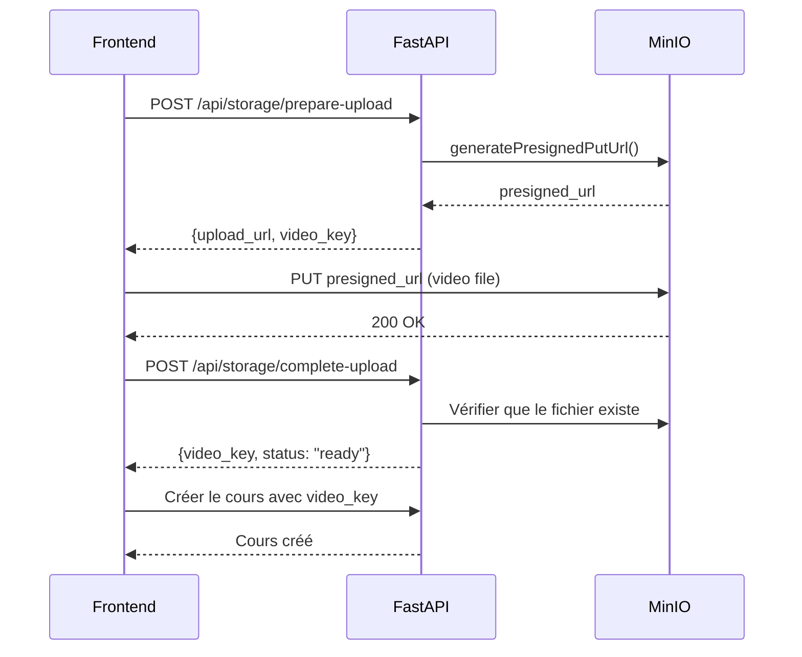

# Documentation complète : Intégration FastAPI pour la gestion des cours

## Table des matières

1. [Vue d'ensemble](#vue-densemble)
2. [Architecture actuelle du frontend](#architecture-actuelle-du-frontend)
3. [Endpoints FastAPI à implémenter](#endpoints-fastapi-à-implémenter)
4. [Structure MongoDB](#structure-mongodb)
5. [Gestion des vidéos et uploads](#gestion-des-vidéos-et-uploads)
6. [Permissions et sécurité](#permissions-et-sécurité)
7. [Plan de mise en œuvre](#plan-de-mise-en-œuvre)
8. [Code d'implémentation](#code-dimplémentation)
9. [Tests d'intégration](#tests-dintégration)
10. [Points critiques](#points-critiques)

---

## Vue d'ensemble

Cette documentation décrit l'intégration complète entre le frontend React existant et le backend FastAPI pour la gestion des cours sur la plateforme LearnEezy.

### Fonctionnalités couvertes

- ✅ **Création de cours** avec modules, leçons, quiz et assignments
- ✅ **Liste des cours** avec pagination
- ✅ **Visualisation détaillée** d'un cours
- ✅ **Modification** d'un cours existant
- ✅ **Suppression** d'un cours
- ✅ **Changement de statut** (draft/published)
- ✅ **Upload de vidéos** via MinIO avec URLs présignées

---

## Architecture actuelle du frontend

### 1. Client FastAPI (`src/services/fastapi-client.ts`)

```typescript
const API_BASE_URL = import.meta.env.VITE_FASTAPI_URL || 'http://localhost:8000';

export const fastapiClient = axios.create({
  baseURL: API_BASE_URL,
  headers: { 'Content-Type': 'application/json' },
  withCredentials: true,
});

// Intercepteur pour ajouter le token JWT
fastapiClient.interceptors.request.use((config) => {
  const token = localStorage.getItem('access_token');
  if (token) {
    config.headers.Authorization = `Bearer ${token}`;
  }
  return config;
});
```

### 2. Types TypeScript (`src/types/fastapi.ts`)

```typescript
export interface Quiz {
  title: string;
  passingScore: number;
  timeLimit?: number;
  questions: QuizQuestion[];
}

export interface Content {
  title: string;
  duration: string;
  description: string;
  video_key?: string;
  transcription?: string;
  quiz?: Quiz;
}

export interface Module {
  title: string;
  description?: string;
  duration: string;
  content: Content[];
  quiz?: Quiz;
  assignment?: Assignment;
}

export interface Course {
  id?: string;
  title: string;
  description: string;
  price?: number;
  category?: string;
  duration?: string;
  level: string;
  cycle?: string;
  cycle_tags?: string[];
  image_url?: string;
  modules: Module[];
  resources?: Resource[];
  owner_type?: string;
  owner_id?: number;
  status?: 'draft' | 'published';
  created_at?: string;
  updated_at?: string;
}
```

### 3. Pages Frontend

| Page | Route | Fonction |
|------|-------|----------|
| **CreateCoursePage** | `/dashboard/superadmin/courses/create` | Création de cours complets |
| **AdminCourses** | `/dashboard/superadmin/courses` | Liste des cours |
| **CourseViewModal** | Modal | Visualisation détaillée |
| **EditCourse** | `/dashboard/superadmin/courses/{id}/edit` | Modification |

---

## Endpoints FastAPI à implémenter

### 1. Liste des cours (GET `/api/courses/`)

**Paramètres de requête :**
- `page` (int, default=1) : Numéro de page
- `per_page` (int, default=10, max=100) : Résultats par page

**Réponse :**
```json
[
  {
    "id": "507f1f77bcf86cd799439011",
    "title": "Introduction à React",
    "description": "Cours complet React",
    "price": 99.99,
    "category": "Développement Web",
    "duration": "10h",
    "level": "débutant",
    "image_url": "https://...",
    "owner_type": "learneezy",
    "owner_id": 1,
    "status": "published",
    "created_at": "2025-01-15T10:00:00Z",
    "updated_at": "2025-01-15T10:00:00Z",
    "modules": [...]
  }
]
```

**Permissions :**
- `superadmin` : Voit tous les cours
- `of_admin` : Voit uniquement ses cours (`owner_id` = user.of_id)
- `independent_trainer` : Voit uniquement ses cours (`owner_id` = user.id)

---

### 2. Récupérer un cours (GET `/api/courses/{course_id}`)

**Paramètres :**
- `course_id` (str) : ID MongoDB du cours

**Réponse :**
```json
{
  "id": "507f1f77bcf86cd799439011",
  "title": "Introduction à React",
  "modules": [
    {
      "title": "Module 1",
      "duration": "2h",
      "content": [
        {
          "title": "Leçon 1",
          "duration": "30min",
          "description": "Introduction aux composants",
          "video_key": "courses/video123.mp4",
          "quiz": {...}
        }
      ],
      "assignment": {...}
    }
  ]
}
```

---

### 3. Créer un cours (POST `/api/courses/`)

**Body :**
```json
{
  "title": "Nouveau cours",
  "description": "<p>Description en HTML</p>",
  "level": "débutant",
  "modules": [
    {
      "title": "Module 1",
      "duration": "2h",
      "content": [
        {
          "title": "Leçon 1",
          "duration": "30min",
          "description": "Intro",
          "video_key": "courses/video123.mp4"
        }
      ]
    }
  ]
}
```

**Réponse :** 201 Created avec le cours complet

**Logique backend :**
1. Authentifier l'utilisateur (JWT)
2. Déterminer `owner_type` et `owner_id` selon le rôle
3. Valider les données (au moins 1 module)
4. Générer `id` MongoDB
5. Ajouter `created_at`, `updated_at`, `status: "draft"`
6. Insérer dans MongoDB
7. Retourner le cours créé

---

### 4. Modifier un cours (PUT `/api/courses/{course_id}`)

**Body :** Cours complet (même structure que POST)

**Réponse :** 200 OK avec le cours mis à jour

**Logique :**
1. Vérifier que le cours existe
2. Vérifier les permissions (`check_course_access`)
3. Mettre à jour `updated_at`
4. Remplacer le document MongoDB
5. Retourner le cours modifié

---

### 5. Supprimer un cours (DELETE `/api/courses/{course_id}`)

**Réponse :** 204 No Content

**Logique :**
1. Vérifier les permissions
2. Supprimer le document MongoDB
3. (Optionnel) Nettoyer les vidéos associées sur MinIO

---

### 6. Changer le statut (PATCH `/api/courses/{course_id}/status`)

**Paramètres de requête :**
- `status` (str) : "draft" ou "published"

**Réponse :** 200 OK avec le cours mis à jour

**Logique :**
1. Valider que `status` est "draft" ou "published"
2. Si "published", vérifier que le cours est complet
3. Mettre à jour uniquement le champ `status`
4. Retourner le cours

---

### 7. Préparer l'upload d'une vidéo (POST `/api/storage/prepare-upload`)

**Body :**
```json
{
  "filename": "lesson1.mp4",
  "content_type": "video/mp4"
}
```

**Réponse :**
```json
{
  "upload_url": "https://minio.../presigned-url",
  "video_key": "courses/uuid-lesson1.mp4",
  "expires_in": 3600
}
```

---

### 8. Terminer l'upload (POST `/api/storage/complete-upload`)

**Body :**
```json
{
  "video_key": "courses/uuid-lesson1.mp4"
}
```

**Réponse :**
```json
{
  "video_key": "courses/uuid-lesson1.mp4",
  "status": "ready"
}
```

---

### 9. Obtenir l'URL de lecture (GET `/api/storage/play`)

**Paramètres de requête :**
- `video_key` (str) : Clé de la vidéo

**Réponse :**
```json
{
  "play_url": "https://minio.../presigned-read-url",
  "expires_in": 3600
}
```

---

## Structure MongoDB

### Collection `courses`

```javascript
{
  "_id": ObjectId("507f1f77bcf86cd799439011"),
  "title": "Introduction à React",
  "description": "<p>Cours complet pour apprendre React</p>",
  "price": 99.99,
  "category": "Développement Web",
  "duration": "10h",
  "level": "débutant",
  "cycle": "Cycle 1",
  "cycle_tags": ["React", "JavaScript", "Frontend"],
  "image_url": "https://storage.../course-image.jpg",
  "owner_type": "learneezy",  // "learneezy" | "of" | "independent_trainer"
  "owner_id": 1,                // ID de l'owner (superadmin_id, of_id, trainer_id)
  "status": "published",        // "draft" | "published"
  "created_at": ISODate("2025-01-15T10:00:00Z"),
  "updated_at": ISODate("2025-01-15T10:00:00Z"),
  
  "modules": [
    {
      "title": "Les bases de React",
      "description": "Introduction aux concepts fondamentaux",
      "duration": "2h",
      "content": [
        {
          "title": "Introduction aux composants",
          "duration": "30min",
          "description": "<p>Qu'est-ce qu'un composant React ?</p>",
          "video_key": "courses/507f-lesson1.mp4",
          "transcription": "Texte de la transcription...",
          "quiz": {
            "title": "Quiz sur les composants",
            "passingScore": 70,
            "timeLimit": 600,
            "questions": [
              {
                "type": "single-choice",
                "question": "Qu'est-ce qu'un composant ?",
                "options": ["Une fonction", "Une classe", "Les deux"],
                "correctAnswer": 2,
                "points": 10,
                "explanation": "Un composant peut être une fonction ou une classe"
              }
            ]
          }
        }
      ],
      "quiz": {
        "title": "Quiz du module 1",
        "passingScore": 80,
        "questions": [...]
      },
      "assignment": {
        "title": "Projet pratique",
        "description": "Créez votre premier composant",
        "dueDate": "2025-02-15",
        "maxScore": 100,
        "instructions": "<p>Créez un composant Button</p>",
        "resources": [
          {
            "name": "Template de départ",
            "url": "https://storage.../template.zip"
          }
        ]
      }
    }
  ],
  
  "resources": [
    {
      "name": "Slides du cours",
      "url": "https://storage.../slides.pdf"
    }
  ]
}
```

### Indexes recommandés

```javascript
// Index sur owner_type et owner_id pour les requêtes de liste
db.courses.createIndex({ "owner_type": 1, "owner_id": 1 });

// Index sur le statut
db.courses.createIndex({ "status": 1 });

// Index fulltext sur title et category
db.courses.createIndex({ 
  "title": "text", 
  "category": "text",
  "description": "text"
});

// Index sur created_at pour le tri
db.courses.createIndex({ "created_at": -1 });
```

---

## Gestion des vidéos et uploads

### Flow complet d'upload



### Configuration MinIO requise

```python
# backend/config.py
class Settings:
    MINIO_ENDPOINT: str = "minio.example.com"
    MINIO_ACCESS_KEY: str = "access_key"
    MINIO_SECRET_KEY: str = "secret_key"
    MINIO_BUCKET_COURSES: str = "courses"
    MINIO_USE_SSL: bool = True
```

### Code d'exemple pour MinIO

```python
# backend/services/storage.py
from minio import Minio
from datetime import timedelta

class StorageService:
    def __init__(self):
        self.client = Minio(
            settings.MINIO_ENDPOINT,
            access_key=settings.MINIO_ACCESS_KEY,
            secret_key=settings.MINIO_SECRET_KEY,
            secure=settings.MINIO_USE_SSL
        )
    
    def generate_upload_url(self, filename: str) -> dict:
        video_key = f"courses/{uuid.uuid4()}-{filename}"
        
        upload_url = self.client.presigned_put_object(
            bucket_name=settings.MINIO_BUCKET_COURSES,
            object_name=video_key,
            expires=timedelta(hours=1)
        )
        
        return {
            "upload_url": upload_url,
            "video_key": video_key,
            "expires_in": 3600
        }
    
    def generate_play_url(self, video_key: str) -> str:
        return self.client.presigned_get_object(
            bucket_name=settings.MINIO_BUCKET_COURSES,
            object_name=video_key,
            expires=timedelta(hours=1)
        )
```

---

## Permissions et sécurité

### Matrice de permissions

| Action | Superadmin | OF_ADMIN | Independent Trainer | Apprenant |
|--------|-----------|----------|---------------------|-----------|
| Lister tous les cours | ✅ | ❌ | ❌ | ❌ |
| Lister ses propres cours | ✅ | ✅ | ✅ | ❌ |
| Créer un cours | ✅ | ✅ | ✅ | ❌ |
| Voir n'importe quel cours | ✅ | ❌ | ❌ | ❌ |
| Voir ses propres cours | ✅ | ✅ | ✅ | ❌ |
| Modifier n'importe quel cours | ✅ | ❌ | ❌ | ❌ |
| Modifier ses propres cours | ✅ | ✅ | ✅ | ❌ |
| Supprimer n'importe quel cours | ✅ | ❌ | ❌ | ❌ |
| Supprimer ses propres cours | ✅ | ✅ | ✅ | ❌ |
| Voir les cours publiés | ✅ | ✅ | ✅ | ✅ |

### Fonction de vérification des accès

```python
# backend/services/permissions.py
from fastapi import HTTPException
from models.user import User
from models.course import CourseInDB

def check_course_access(user: User, course: CourseInDB, action: str) -> bool:
    """
    Vérifie si l'utilisateur a le droit d'effectuer l'action sur le cours.
    
    Actions: "view", "edit", "delete"
    """
    # Superadmin a tous les droits
    if user.role == "superadmin":
        return True
    
    # Pour les autres, vérifier la propriété
    if action in ["edit", "delete"]:
        if course.owner_type == "learneezy":
            return False  # Seul superadmin peut modifier les cours Learneezy
        
        if course.owner_type == "of":
            return user.role == "of_admin" and user.of_id == course.owner_id
        
        if course.owner_type == "independent_trainer":
            return user.role == "independent_trainer" and user.id == course.owner_id
    
    # Pour la visualisation
    if action == "view":
        if course.status == "published":
            return True  # Tout le monde peut voir les cours publiés
        
        # Pour les drafts, vérifier la propriété
        if course.owner_type == "of":
            return user.of_id == course.owner_id
        
        if course.owner_type == "independent_trainer":
            return user.id == course.owner_id
    
    return False
```

---

## Plan de mise en œuvre

### Phase 1 : Configuration de base (30 min)

#### 1.1 Installer les dépendances

```bash
pip install motor  # Async MongoDB driver
pip install minio  # MinIO client
```

#### 1.2 Créer la connexion MongoDB

```python
# backend/db/mongodb.py
from motor.motor_asyncio import AsyncIOMotorClient
from typing import Optional
from config import settings

class MongoDB:
    client: Optional[AsyncIOMotorClient] = None

db = MongoDB()

async def connect_to_mongo():
    """Connecter à MongoDB au démarrage"""
    db.client = AsyncIOMotorClient(settings.MONGODB_URL)
    print(f"✅ Connecté à MongoDB: {settings.MONGODB_DB_NAME}")

async def close_mongo_connection():
    """Fermer la connexion MongoDB à l'arrêt"""
    if db.client:
        db.client.close()
        print("❌ Connexion MongoDB fermée")

def get_database():
    """Obtenir la base de données"""
    if not db.client:
        raise Exception("MongoDB non connecté")
    return db.client[settings.MONGODB_DB_NAME]
```

#### 1.3 Ajouter au `main.py`

```python
# backend/main.py
from fastapi import FastAPI
from db.mongodb import connect_to_mongo, close_mongo_connection

app = FastAPI()

@app.on_event("startup")
async def startup_db_client():
    await connect_to_mongo()

@app.on_event("shutdown")
async def shutdown_db_client():
    await close_mongo_connection()
```

#### 1.4 Variables d'environnement

```bash
# backend/.env
MONGODB_URL=mongodb://localhost:27017
MONGODB_DB_NAME=learneezy
MINIO_ENDPOINT=minio.example.com
MINIO_ACCESS_KEY=minioadmin
MINIO_SECRET_KEY=minioadmin
MINIO_BUCKET_COURSES=courses
```

---

### Phase 2 : Modèles Pydantic (1h)

#### 2.1 Créer les modèles

Voir le fichier `backend/models/course.py` dans la section [Code d'implémentation](#code-dimplémentation).

---

### Phase 3 : Endpoints CRUD (2h)

#### 3.1 Créer le router

Voir le fichier `backend/routes/courses.py` dans la section [Code d'implémentation](#code-dimplémentation).

#### 3.2 Ajouter au `main.py`

```python
from routes import courses

app.include_router(courses.router)
```

---

### Phase 4 : Tests d'intégration (1h)

Voir la section [Tests d'intégration](#tests-dintégration).

---

### Phase 5 : Optimisations (30 min)

#### 5.1 Ajouter les indexes MongoDB

```python
# backend/scripts/create_indexes.py
from motor.motor_asyncio import AsyncIOMotorClient

async def create_indexes():
    client = AsyncIOMotorClient("mongodb://localhost:27017")
    db = client.learneezy
    
    await db.courses.create_index([("owner_type", 1), ("owner_id", 1)])
    await db.courses.create_index([("status", 1)])
    await db.courses.create_index([("created_at", -1)])
    await db.courses.create_index([
        ("title", "text"),
        ("category", "text"),
        ("description", "text")
    ])
    
    print("✅ Indexes créés")

if __name__ == "__main__":
    import asyncio
    asyncio.run(create_indexes())
```

#### 5.2 Gestion des erreurs

```python
# backend/utils/exceptions.py
from fastapi import HTTPException

class CourseNotFound(HTTPException):
    def __init__(self, course_id: str):
        super().__init__(
            status_code=404,
            detail=f"Course with id {course_id} not found"
        )

class InsufficientPermissions(HTTPException):
    def __init__(self):
        super().__init__(
            status_code=403,
            detail="You don't have permission to perform this action"
        )

class InvalidCourseData(HTTPException):
    def __init__(self, message: str):
        super().__init__(
            status_code=422,
            detail=message
        )
```

---

## Code d'implémentation

### `backend/models/course.py`

```python
from pydantic import BaseModel, Field
from typing import List, Optional
from datetime import datetime
from bson import ObjectId

class PyObjectId(ObjectId):
    @classmethod
    def __get_validators__(cls):
        yield cls.validate

    @classmethod
    def validate(cls, v):
        if not ObjectId.is_valid(v):
            raise ValueError("Invalid ObjectId")
        return ObjectId(v)

    @classmethod
    def __modify_schema__(cls, field_schema):
        field_schema.update(type="string")

class QuizQuestion(BaseModel):
    type: str  # "single-choice" | "multiple-choice" | "true-false" | "fill-blank"
    question: str
    options: List[str]
    correctAnswer: int | List[int]  # Index ou liste d'index
    points: int = 10
    explanation: Optional[str]

class Quiz(BaseModel):
    title: str
    passingScore: int = 70
    timeLimit: Optional[int]  # En secondes
    questions: List[QuizQuestion]

class Resource(BaseModel):
    name: str
    url: str

class Assignment(BaseModel):
    title: str
    description: str
    dueDate: Optional[str]
    maxScore: int = 100
    instructions: str
    resources: Optional[List[Resource]] = []

class Content(BaseModel):
    title: str
    duration: str
    description: str
    video_key: Optional[str]
    transcription: Optional[str]
    quiz: Optional[Quiz]

class Module(BaseModel):
    title: str
    description: Optional[str]
    duration: str
    content: List[Content]
    quiz: Optional[Quiz]
    assignment: Optional[Assignment]

class CourseBase(BaseModel):
    title: str
    description: str
    price: Optional[float]
    category: Optional[str]
    duration: Optional[str]
    level: str
    cycle: Optional[str]
    cycle_tags: Optional[List[str]]
    image_url: Optional[str]
    modules: List[Module]
    resources: Optional[List[Resource]] = []

class CourseCreate(CourseBase):
    """Schéma pour créer un cours"""
    pass

class CourseUpdate(CourseBase):
    """Schéma pour mettre à jour un cours"""
    pass

class CourseInDB(CourseBase):
    """Schéma du cours stocké en DB"""
    id: str = Field(alias="_id")
    owner_type: str  # "learneezy" | "of" | "independent_trainer"
    owner_id: int
    status: str = "draft"  # "draft" | "published"
    created_at: datetime
    updated_at: datetime

    class Config:
        json_encoders = {ObjectId: str}
        populate_by_name = True

class CourseResponse(CourseInDB):
    """Schéma de réponse API"""
    pass
```

---

### `backend/routes/courses.py`

```python
from fastapi import APIRouter, Depends, Query, HTTPException, status
from typing import List
from bson import ObjectId
from datetime import datetime

from models.course import (
    CourseCreate, CourseUpdate, CourseResponse, CourseInDB
)
from models.user import User
from db.mongodb import get_database
from auth.dependencies import get_current_user
from services.permissions import check_course_access
from utils.exceptions import CourseNotFound, InsufficientPermissions

router = APIRouter(prefix="/api/courses", tags=["courses"])

@router.post("/", response_model=CourseResponse, status_code=status.HTTP_201_CREATED)
async def create_course(
    course: CourseCreate,
    current_user: User = Depends(get_current_user)
):
    """Créer un nouveau cours"""
    db = get_database()
    
    # Déterminer owner_type et owner_id selon le rôle
    if current_user.role == "superadmin":
        owner_type = "learneezy"
        owner_id = current_user.id
    elif current_user.role == "of_admin":
        owner_type = "of"
        owner_id = current_user.of_id
    elif current_user.role == "independent_trainer":
        owner_type = "independent_trainer"
        owner_id = current_user.id
    else:
        raise InsufficientPermissions()
    
    # Validation : au moins 1 module
    if not course.modules:
        raise InvalidCourseData("Le cours doit contenir au moins 1 module")
    
    # Préparer le document
    course_dict = course.dict()
    course_dict.update({
        "owner_type": owner_type,
        "owner_id": owner_id,
        "status": "draft",
        "created_at": datetime.utcnow(),
        "updated_at": datetime.utcnow()
    })
    
    # Insérer dans MongoDB
    result = await db.courses.insert_one(course_dict)
    
    # Récupérer le cours créé
    created_course = await db.courses.find_one({"_id": result.inserted_id})
    created_course["_id"] = str(created_course["_id"])
    
    return CourseResponse(**created_course)


@router.get("/", response_model=List[CourseResponse])
async def get_courses(
    page: int = Query(1, ge=1),
    per_page: int = Query(10, ge=1, le=100),
    status: Optional[str] = Query(None),
    current_user: User = Depends(get_current_user)
):
    """Lister les cours avec pagination"""
    db = get_database()
    skip = (page - 1) * per_page
    
    # Construire la requête selon le rôle
    query = {}
    
    if current_user.role == "superadmin":
        # Superadmin voit tous les cours
        pass
    elif current_user.role == "of_admin":
        # OF_ADMIN voit uniquement ses cours
        query = {"owner_type": "of", "owner_id": current_user.of_id}
    elif current_user.role == "independent_trainer":
        # Trainer voit uniquement ses cours
        query = {"owner_type": "independent_trainer", "owner_id": current_user.id}
    else:
        # Autres rôles : cours publiés uniquement
        query = {"status": "published"}
    
    # Filtrer par statut si fourni
    if status:
        query["status"] = status
    
    # Exécuter la requête
    cursor = db.courses.find(query).skip(skip).limit(per_page).sort("created_at", -1)
    courses = await cursor.to_list(length=per_page)
    
    # Convertir ObjectId en string
    for course in courses:
        course["_id"] = str(course["_id"])
    
    return [CourseResponse(**course) for course in courses]


@router.get("/{course_id}", response_model=CourseResponse)
async def get_course(
    course_id: str,
    current_user: User = Depends(get_current_user)
):
    """Récupérer un cours par ID"""
    db = get_database()
    
    # Vérifier que l'ID est valide
    if not ObjectId.is_valid(course_id):
        raise CourseNotFound(course_id)
    
    # Récupérer le cours
    course = await db.courses.find_one({"_id": ObjectId(course_id)})
    
    if not course:
        raise CourseNotFound(course_id)
    
    # Convertir en CourseInDB pour vérifier les permissions
    course["_id"] = str(course["_id"])
    course_db = CourseInDB(**course)
    
    # Vérifier les permissions
    if not check_course_access(current_user, course_db, "view"):
        raise InsufficientPermissions()
    
    return CourseResponse(**course)


@router.put("/{course_id}", response_model=CourseResponse)
async def update_course(
    course_id: str,
    course: CourseUpdate,
    current_user: User = Depends(get_current_user)
):
    """Mettre à jour un cours"""
    db = get_database()
    
    # Vérifier que l'ID est valide
    if not ObjectId.is_valid(course_id):
        raise CourseNotFound(course_id)
    
    # Récupérer le cours existant
    existing_course = await db.courses.find_one({"_id": ObjectId(course_id)})
    
    if not existing_course:
        raise CourseNotFound(course_id)
    
    # Vérifier les permissions
    existing_course["_id"] = str(existing_course["_id"])
    course_db = CourseInDB(**existing_course)
    
    if not check_course_access(current_user, course_db, "edit"):
        raise InsufficientPermissions()
    
    # Mettre à jour le cours
    course_dict = course.dict()
    course_dict["updated_at"] = datetime.utcnow()
    
    await db.courses.update_one(
        {"_id": ObjectId(course_id)},
        {"$set": course_dict}
    )
    
    # Récupérer le cours mis à jour
    updated_course = await db.courses.find_one({"_id": ObjectId(course_id)})
    updated_course["_id"] = str(updated_course["_id"])
    
    return CourseResponse(**updated_course)


@router.delete("/{course_id}", status_code=status.HTTP_204_NO_CONTENT)
async def delete_course(
    course_id: str,
    current_user: User = Depends(get_current_user)
):
    """Supprimer un cours"""
    db = get_database()
    
    # Vérifier que l'ID est valide
    if not ObjectId.is_valid(course_id):
        raise CourseNotFound(course_id)
    
    # Récupérer le cours
    course = await db.courses.find_one({"_id": ObjectId(course_id)})
    
    if not course:
        raise CourseNotFound(course_id)
    
    # Vérifier les permissions
    course["_id"] = str(course["_id"])
    course_db = CourseInDB(**course)
    
    if not check_course_access(current_user, course_db, "delete"):
        raise InsufficientPermissions()
    
    # Supprimer le cours
    await db.courses.delete_one({"_id": ObjectId(course_id)})
    
    return None


@router.patch("/{course_id}/status", response_model=CourseResponse)
async def update_course_status(
    course_id: str,
    status: str = Query(..., regex="^(draft|published)$"),
    current_user: User = Depends(get_current_user)
):
    """Changer le statut d'un cours"""
    db = get_database()
    
    # Vérifier que l'ID est valide
    if not ObjectId.is_valid(course_id):
        raise CourseNotFound(course_id)
    
    # Récupérer le cours
    course = await db.courses.find_one({"_id": ObjectId(course_id)})
    
    if not course:
        raise CourseNotFound(course_id)
    
    # Vérifier les permissions
    course["_id"] = str(course["_id"])
    course_db = CourseInDB(**course)
    
    if not check_course_access(current_user, course_db, "edit"):
        raise InsufficientPermissions()
    
    # Si on publie, vérifier que le cours est complet
    if status == "published":
        if not course.get("modules") or len(course["modules"]) == 0:
            raise InvalidCourseData("Impossible de publier un cours sans modules")
    
    # Mettre à jour le statut
    await db.courses.update_one(
        {"_id": ObjectId(course_id)},
        {"$set": {"status": status, "updated_at": datetime.utcnow()}}
    )
    
    # Récupérer le cours mis à jour
    updated_course = await db.courses.find_one({"_id": ObjectId(course_id)})
    updated_course["_id"] = str(updated_course["_id"])
    
    return CourseResponse(**updated_course)
```

---

## Tests d'intégration

### Configuration pytest

```python
# backend/tests/conftest.py
import pytest
from httpx import AsyncClient
from main import app
from db.mongodb import connect_to_mongo, close_mongo_connection

@pytest.fixture(scope="session")
async def test_app():
    await connect_to_mongo()
    yield app
    await close_mongo_connection()

@pytest.fixture
async def client(test_app):
    async with AsyncClient(app=test_app, base_url="http://test") as ac:
        yield ac

@pytest.fixture
def auth_headers():
    # Créer un token JWT de test
    token = create_test_jwt({"sub": "1", "role": "superadmin"})
    return {"Authorization": f"Bearer {token}"}
```

### Tests des endpoints

```python
# backend/tests/test_courses.py
import pytest

@pytest.mark.asyncio
async def test_create_course(client, auth_headers):
    """Test de création de cours"""
    course_data = {
        "title": "Test Course",
        "description": "Test description",
        "level": "débutant",
        "modules": [
            {
                "title": "Module 1",
                "duration": "2h",
                "content": [
                    {
                        "title": "Lesson 1",
                        "duration": "30min",
                        "description": "Test lesson"
                    }
                ]
            }
        ]
    }
    
    response = await client.post(
        "/api/courses/",
        json=course_data,
        headers=auth_headers
    )
    
    assert response.status_code == 201
    data = response.json()
    assert data["title"] == "Test Course"
    assert data["status"] == "draft"
    assert "id" in data


@pytest.mark.asyncio
async def test_get_courses(client, auth_headers):
    """Test de liste des cours"""
    response = await client.get(
        "/api/courses/?page=1&per_page=10",
        headers=auth_headers
    )
    
    assert response.status_code == 200
    data = response.json()
    assert isinstance(data, list)


@pytest.mark.asyncio
async def test_get_course_by_id(client, auth_headers, test_course_id):
    """Test de récupération d'un cours"""
    response = await client.get(
        f"/api/courses/{test_course_id}",
        headers=auth_headers
    )
    
    assert response.status_code == 200
    data = response.json()
    assert data["id"] == test_course_id


@pytest.mark.asyncio
async def test_update_course(client, auth_headers, test_course_id):
    """Test de mise à jour d'un cours"""
    update_data = {
        "title": "Updated Course",
        "description": "Updated description",
        "level": "intermédiaire",
        "modules": [...]
    }
    
    response = await client.put(
        f"/api/courses/{test_course_id}",
        json=update_data,
        headers=auth_headers
    )
    
    assert response.status_code == 200
    data = response.json()
    assert data["title"] == "Updated Course"


@pytest.mark.asyncio
async def test_delete_course(client, auth_headers, test_course_id):
    """Test de suppression d'un cours"""
    response = await client.delete(
        f"/api/courses/{test_course_id}",
        headers=auth_headers
    )
    
    assert response.status_code == 204


@pytest.mark.asyncio
async def test_update_course_status(client, auth_headers, test_course_id):
    """Test de changement de statut"""
    response = await client.patch(
        f"/api/courses/{test_course_id}/status?status=published",
        headers=auth_headers
    )
    
    assert response.status_code == 200
    data = response.json()
    assert data["status"] == "published"


@pytest.mark.asyncio
async def test_insufficient_permissions(client):
    """Test avec utilisateur non autorisé"""
    # Créer un token pour un apprenant
    apprenant_headers = create_headers_for_role("apprenant")
    
    response = await client.post(
        "/api/courses/",
        json={...},
        headers=apprenant_headers
    )
    
    assert response.status_code == 403
```

---

## Points critiques

### 1. Format des IDs

⚠️ **MongoDB utilise ObjectId, pas des UUIDs**

```python
# ✅ Correct
from bson import ObjectId

course_id = ObjectId("507f1f77bcf86cd799439011")
course = await db.courses.find_one({"_id": course_id})

# ❌ Incorrect
course = await db.courses.find_one({"_id": "507f1f77bcf86cd799439011"})
```

### 2. Description en HTML

Le frontend utilise un éditeur WYSIWYG qui génère du HTML. Le backend doit accepter et stocker ce HTML.

```python
# ✅ Le backend accepte du HTML
course.description = "<p>Description avec <strong>HTML</strong></p>"
```

### 3. Gestion des `video_key`

- Le frontend upload d'abord la vidéo sur MinIO
- Il reçoit un `video_key` (ex: `"courses/uuid-video.mp4"`)
- Ce `video_key` est ensuite inclus dans le cours
- Le backend ne fait que stocker cette clé
- Pour la lecture, utiliser l'endpoint `/api/storage/play`

### 4. Modules sans leçons

Les modules peuvent avoir uniquement des quiz ou des assignments sans contenu de leçons.

```python
# ✅ Valide
module = {
    "title": "Module de test",
    "duration": "1h",
    "content": [],  # Pas de leçons
    "quiz": {...}    # Uniquement un quiz
}
```

### 5. Catégories personnalisées

Le frontend permet de créer des catégories personnalisées. Le backend doit accepter n'importe quelle chaîne pour `category`.

```python
# ✅ Pas de validation stricte sur category
course.category = "Ma catégorie personnalisée"
```

### 6. Cycle tags

Les `cycle_tags` sont utilisés pour grouper les cours par cycle pédagogique.

```python
course.cycle = "Cycle 1"
course.cycle_tags = ["React", "JavaScript", "Frontend"]
```

---

## Résumé des endpoints

| Méthode | Endpoint | Description |
|---------|----------|-------------|
| **POST** | `/api/courses/` | Créer un cours |
| **GET** | `/api/courses/` | Lister les cours (pagination) |
| **GET** | `/api/courses/{course_id}` | Récupérer un cours |
| **PUT** | `/api/courses/{course_id}` | Mettre à jour un cours |
| **DELETE** | `/api/courses/{course_id}` | Supprimer un cours |
| **PATCH** | `/api/courses/{course_id}/status` | Changer le statut |
| **POST** | `/api/storage/prepare-upload` | Préparer l'upload vidéo |
| **POST** | `/api/storage/complete-upload` | Terminer l'upload vidéo |
| **GET** | `/api/storage/play` | Obtenir l'URL de lecture |

---

## Checklist de validation

### Phase 1 : Base ✅
- [ ] MongoDB connecté
- [ ] Modèles Pydantic créés
- [ ] Variables d'environnement configurées

### Phase 2 : CRUD ✅
- [ ] Endpoint POST `/api/courses/` fonctionne
- [ ] Endpoint GET `/api/courses/` fonctionne
- [ ] Endpoint GET `/api/courses/{id}` fonctionne
- [ ] Endpoint PUT `/api/courses/{id}` fonctionne
- [ ] Endpoint DELETE `/api/courses/{id}` fonctionne
- [ ] Endpoint PATCH `/api/courses/{id}/status` fonctionne

### Phase 3 : Sécurité ✅
- [ ] Permissions superadmin vérifiées
- [ ] Permissions OF_ADMIN vérifiées
- [ ] Permissions independent_trainer vérifiées
- [ ] Permissions apprenant vérifiées (lectures seules)

### Phase 4 : Storage ✅
- [ ] Upload de vidéos fonctionne
- [ ] Lecture de vidéos fonctionne
- [ ] URLs présignées générées correctement

### Phase 5 : Tests ✅
- [ ] Tests d'intégration passent
- [ ] Tests de permissions passent
- [ ] Tests d'erreurs (404, 403, 422) passent

### Phase 6 : Production ✅
- [ ] Indexes MongoDB créés
- [ ] Gestion des erreurs robuste
- [ ] Logs configurés
- [ ] Documentation OpenAPI générée

---

## Support et débogage

### Logs recommandés

```python
import logging

logger = logging.getLogger(__name__)

@router.post("/")
async def create_course(...):
    logger.info(f"Creating course: {course.title} by user {current_user.id}")
    
    try:
        # ... logique
        logger.info(f"Course created successfully: {result.inserted_id}")
    except Exception as e:
        logger.error(f"Error creating course: {str(e)}")
        raise
```

### Commandes utiles

```bash
# Vérifier la connexion MongoDB
mongosh "mongodb://localhost:27017/learneezy"

# Lister les cours
db.courses.find().pretty()

# Compter les cours
db.courses.countDocuments()

# Supprimer tous les cours de test
db.courses.deleteMany({"title": /Test/})

# Vérifier les indexes
db.courses.getIndexes()
```

---

## Conclusion

Cette documentation couvre l'intégration complète des cours avec FastAPI. Les points clés sont :

1. **MongoDB** pour le stockage flexible des cours
2. **MinIO** pour le stockage des vidéos
3. **Permissions** basées sur les rôles
4. **API REST** complète avec CRUD
5. **Tests** d'intégration robustes

Pour toute question, consultez :
- [Documentation FastAPI](https://fastapi.tiangolo.com/)
- [Documentation Motor](https://motor.readthedocs.io/)
- [Documentation MinIO Python](https://min.io/docs/minio/linux/developers/python/minio-py.html)
